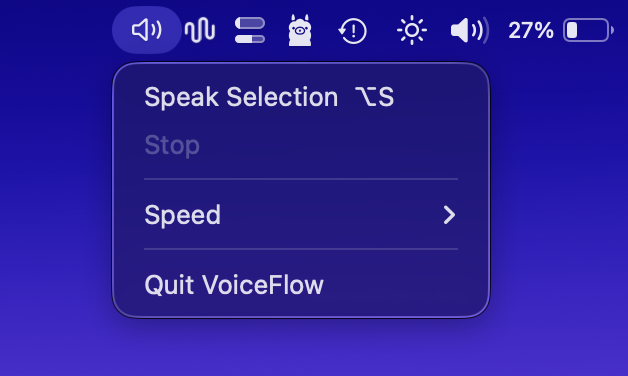
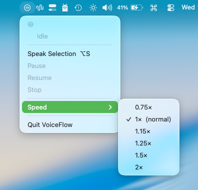

# VoiceFlow

A native macOS menu bar app that reads selected text aloud using a local Kokoro TTS server. Select text anywhere, press `⌥S`, and hear it spoken — no internet required.

| Menu | Speed |
|------|-------|
|  |  |

## Features

- **Global hotkey** — `⌥S` speaks the selected text, or stops playback if already speaking
- **Menu bar control** — click the speaker icon to speak, stop, or adjust speed
- **Queued playback** — long text is split into segments; the next segment is pre-synthesized while the current one plays, so transitions are near-instant
- **Playback speed** — 0.75× to 2× in the Speed submenu, applied without re-synthesis
- **Visual status** — SF Symbol in the menu bar reflects idle / processing / playing / error state
- **Works in any app** — reads selected text via the macOS Accessibility API
- **Language** — infers American English vs Brazilian Portuguese from the text (`NaturalLanguage`) and picks the matching Kokoro voice for the whole utterance

## Requirements

- macOS 14+
- [Kokoro-FastAPI](https://github.com/remsky/Kokoro-FastAPI) running locally on port 8880
- Xcode Command Line Tools (`xcode-select --install`)

## Setup

### 1. Start Kokoro

```bash
cp config/launchd/start.sh ~/.kokoro-fastapi/start.sh
chmod +x ~/.kokoro-fastapi/start.sh

python3 -c "
import sys, pathlib
p = pathlib.Path('config/launchd/com.local.kokoro.plist').read_text()
sys.stdout.write(p.replace('__HOME__', str(pathlib.Path.home())))
" > ~/Library/LaunchAgents/com.local.kokoro.plist
launchctl load ~/Library/LaunchAgents/com.local.kokoro.plist

curl http://localhost:8880/v1/audio/voices
```

### 2. Build and install VoiceFlow

From the `VoiceFlow/` directory:

| Command | What it does |
|---------|----------------|
| `make install` | Release build, bundle `.app`, sign, copy to `~/Applications/` (default) |
| `make build` | Debug build only |
| `make bundle` | Build + create `VoiceFlow.app` in repo |
| `make clean` | Remove build artifacts and bundle |

### 3. Grant Accessibility

**System Settings → Privacy & Security → Accessibility** — add VoiceFlow once. The dev signing identity stays stable across rebuilds so permission is not revoked.

### 4. Launch

```bash
open ~/Applications/VoiceFlow.app
```

## Usage

| Action | How |
|--------|-----|
| Speak selected text | `⌥S` or menu bar → Speak Selection |
| Stop playback | `⌥S` again, or menu bar → Stop |
| Change speed | Menu bar → Speed |
| Quit | Menu bar → Quit VoiceFlow |

## Configuration

Environment variables (shell profile, or `EnvironmentVariables` in a launchd plist):

| Variable | Default | Purpose |
|----------|---------|---------|
| `KOKORO_HOST` | `localhost` | Kokoro server host |
| `KOKORO_PORT` | `8880` | Kokoro server port |
| `KOKORO_EN_VOICE` | `af_heart` | American English voice (`af_*` / `am_*`) |
| `KOKORO_PT_BR_VOICE` | `pf_dora` | Brazilian Portuguese voice (`pf_*` / `pm_*`) |
| `VOICEFLOW_DEBUG_LOG` | off in release | `1` / `true` / `yes` enables file logging for release builds |
| `VOICEFLOW_DEBUG_LOG_FILE` | `/tmp/voiceflow-debug.log` | Absolute path override (also enables release logging if set) |

### Debug log (segmentation / selection issues)

- **Debug** Swift builds always append to the log file.
- **Release** (`make install`): GUI `open` usually does not inherit shell env — run with logging, e.g.  
  `VOICEFLOW_DEBUG_LOG=1 ~/Applications/VoiceFlow.app/Contents/MacOS/VoiceFlow`  
  or `launchctl setenv VOICEFLOW_DEBUG_LOG 1` then launch from Finder.

Each ⌥S on a selection writes a `speech pipeline` block: newline counts in the **raw** `kAXSelectedText` string, whether **selection recovery** ran (many UIs return text with **no** `\n` between paragraphs), `preprocessedVisibleExcerpt`, block vs segment counts, and segment previews. **Logs may contain full selections** — redact before sharing.

### Kokoro API and text shaping

[Kokoro-FastAPI](https://github.com/remsky/Kokoro-FastAPI) documents `input`, `voice`, optional `speed` / `normalization_options` — not general SSML. The server also chunks long input internally. VoiceFlow adds client-side segmentation (~320 characters, sentence-aware) and treats markdown line breaks as separate blocks when the next line looks like a new line of thought (see `TextProcessor`).

**Glued selections:** if the focused app returns one line with no newlines (common in chat / web views), VoiceFlow applies light heuristics: space after `lowercase.` + `Uppercase`, `word` + `1.` list markers, breaks before `•` bullets, em/en dashes as paragraph boundaries. This cannot recover perfect structure for every source.
